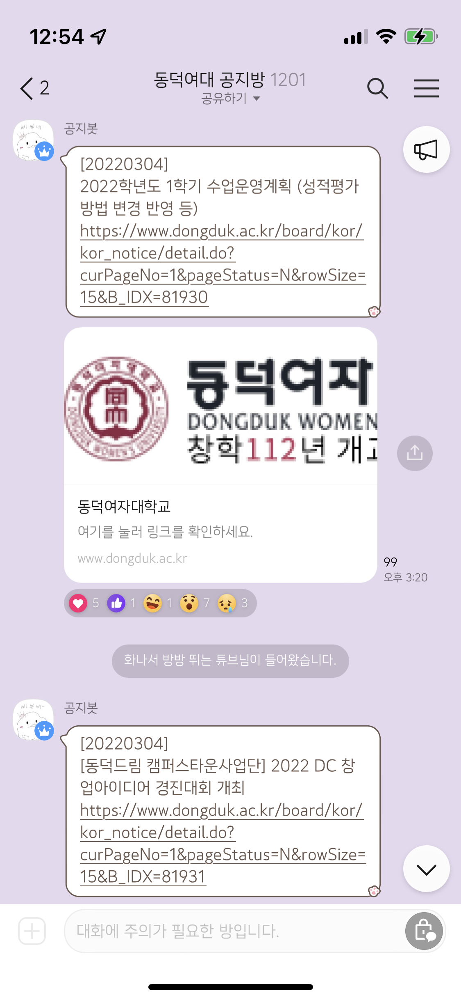

# 학교 공지 봇 만들기

 

> Developer 👩‍💻

- `leejieuns2` : AWS 서버 구축, 작업 알고리즘 구현, 공지봇 운영
- `syeonbot` : 크롤링 구현, 작업 알고리즘 구현, 공지봇 운영
- `yeon2lee` : 로그 파일 생성, 공지봇 운영
- `Hszoo` : 공지봇 운영

 

> Tech Stack 🛠

- Language : Python
- Library : pywin32, requests, apscheduler
- Server : AWS EC2 (Free-tier)

 

> Process 💻

1. pywin32 라이브러리를 사용하여 window GUI를 제어해 미리 개설해 둔 카카오톡 오픈채팅방에 접근한다.
2. [학교 공식 홈페이지 공지사항](https://www.dongduk.ac.kr/board/kor/kor_notice/list.do)을 크롤링하여 공지사항 리스트를 가져온 후, 가공한다.
3. 간단한 알고리즘을 사용하여 실시간으로 받아온 공지 데이터가 이미 전송된 공지사항인지 체크한다.
4. 스케줄러를 사용해 공지사항 올라오는 주기를 고려하여 작업 시간을 설정한다. (15분 주기로 설정함)
5. 작업 시간마다 새롭게 올라온 공지사항을 메세지로 전송한다.

 

> Result (2022.03.06 ver.) 📱

    
    

